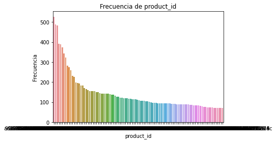

# Sistema de recomendacion de canasta productos para una tienda en línea
Hoy en día, en las tiendas en línea, los usuarios llegan, navegan, se registran, compran o abandonan la tienda, generando una infinidad de registros en cada interacción;  “Olist Store” es una de estas tiendas en línea y quiere aprovechar su histórico de registros de órdenes de compra para incrementar sus ventas, por lo que se plantea el problema de:

¿Qué productos se pueden recomendar al cliente a partir de las compras realizadas por usuarios similares o por compras anteriores hechas por él mismo?

En este reposotorio encontrarás una propuesta de metodología de aprendizaje no supervisado para la recomendación de productos como alternativa de respuesta a la pregunta planteada.

## Secciones 
* [Documentos](./documentos)
  * [Propuesta inicial Sistema de Recomendación](./documentos/Propuesta_inicial_Sistema_de_Recomendacion.pdf)
* [Códigos](./codigos)
* [Data](./data)
* Resultados Preliminares

## Esquema de Datos

## Gráfica: Frecuencia de Productos

